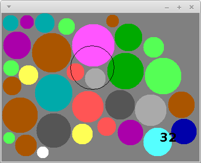

**Due**: Wednesday, Sept 28th by 11:59 PM

Acknowledgment: The idea for this assignment comes from [Tom Ellman](http://pages.vassar.edu/tomellman/) at Vassar College.

CS 201 - Assignment 3
=====================

Your Task
---------

Your task is to complete your implementation of the Disk Placement game described below.

You will use the **Disk** class you implemented in the previous assignment as an important building block in the completed game.

Getting Started
---------------

Start by making a copy of your **CS201\_Assign02** project (which you completed in the previous assignment.)

To make a copy of a project in Eclipse:

-   Right-click on the name of the project in the Package Explorer
-   Choose **Copy**
-   From the **Edit** menu, choose the **Paste** menu item

When you choose **Paste**, you will see a dialog box similar to the following one:

> 

Change the project name to **CS201\_Assign03**:

> 

Click **OK**.

Disk Placement Game
-------------------

In this assignment you will implement the "Disk Placement" game. Here is a screenshot of what the completed game will look like:

> 

The goal is to place disks of random sizes and colors onto the game board so that

1.  no disk overlaps any other disk, and
2.  every disk lies entirely within the rectangular game board

The solid disks are the ones that have been successfully placed. The black disk outline follows the mouse and shows where the next disk could be placed. The number in the lower right-hand corner shows the number of disks that have been successfully placed.  The pink bar at the bottom of the window is a bar showing how much time remains to place the current disk.

The game ends when a disk

* is placed in a position where it overlaps another disk,
* is not entirely placed within the game board, or
* is not placed before the countdown timer expires

When the game ends, a game over message should be displayed:

> 

You can download my implementation of the game to see how it works:

> [disks-obfuscated.jar](disks-obfuscated.jar)

On Windows systems, just double-click on the file. On Linux and MacOS, open a terminal window, change directory into the directory in which you saved the file, and run the command

    java -jar disks-obfuscated.jar

Specifications and Hints
------------------------

You will make all of your code changes to the **DisksPanel** class, which implements the game play.

You should add whatever fields are necessary to represent the state of the game. You will probably want to use an array of **Disk** elements to represent the disks that have been placed.

### Constructor

The constructor should initialize all of the fields of **DisksPanel**.  This could include:

* create a new random **Disk** object and store a reference to it in a field
* create an array of **Disk** references and store a reference to it in a field
* start the count of how many disks have been placed at 0
* initialize the initial timeout duration and the amonut of time remaining to place the current disk (these could be **int** fields)

### Mouse events

The **handleMouseMove** method is called whenever the mouse pointer is moved within the window. You can get the x and y coordinates as follows:


int x = e.getX();
int y = e.getY();


where **e** is the parameter to the method, an instance of the **MouseEvent** class. You will need state variables to keep track of the current location of the mouse pointer.

The **handleMouseClick** method is called whenever a mouse button is clicked. You should use this method to place a disk in the window. You will need to check to ensure that the placed disk

1.  does not overlap any previously placed disk, and
2.  is placed entirely within the bounds of the panel

The **WIDTH** and **HEIGHT** constants provide the width and height of the panel.

Remember that you will need to call **repaint** to force the contents of the panel to be redrawn when the game state changes.

### Disk creation

When the next disk is ready to be placed, its radius should be randomly chosen in the range 10..44, inclusive. You can generate random numbers using an instance of the **java.util.Random** class as a field:


private Random rand;


Create an instance in your constructor:


rand = new Random();


You can generate a random number uniformly chosen from the range 0..n-1, inclusive, using the method call


rand.nextInt(n)


### Disk placement

The game will need to keep track of each disk that has been placed successfully.  One approach is to use an array.  For example, add the following fields to the **DisksPanel** class:


private Disk[] disks;
private int diskCount;


In the constructor:


disks = new Disk[500];
diskCount = 0;


When a disk is placed successfully, a reference to the new **Disk** object should be added to the array.  The **diskCount** field can be used to keep track of how many disks have been placed.  Note that the **diskCount** field also indicates where in the array the next disk should be placed.

### Timer events

The skeleton code for the **DisksPanel** class creates an instance of the **javax.swing.Timer** class and stores it in a field called **timer**.  It also sets up an evvent handler which calls the **handleTimerEvent** method when the timer fires.  The timer is configured to fire after a delay of 0.1 seconds.  So, you can think of one timer "tick" as being one tenth of a second.

You should use an **int** field to keep track of how many ticks the player has left to place the current disk.  Each time a timer event occurs, you should decrement this field.  If the value of the field reaches 0, then the game is over because the timeout expired.

When the game starts (i.e., in the **DisksPanel** constructor), you should call **timer.start()** to start the timer running.  By default, timer events will be generated repeatedly, so you don't need to restart the timer when a timer event occurs.

When a disk is placed successfully, you can call **timer.stop()** followed by **timer.start()** to make sure that the user receives the full amount of time to place the next disk.  Also, you should reset the field that keeps track of how many ticks the user has remaining to place the next disk.

For extra credit, you can make the game more challenging by decreasing the number of ticks available each time the user places a disk successfully.

### The paint method

The **paint** method should use the fields representing the game state to render the current configuration.

Some **java.awt.Graphics** methods that will be useful:

-   **setColor** - Sets the drawing color.
-   **drawOval** - Draws an outlined oval. If the width and height are the same, draws an outlined circle.
-   **fillOval** - Draws a filled oval. If the width and height are the same, draws a filled circle.
-   **setFont** - Sets the current font used for drawing text.
-   **drawString** - Draws a string of text characters.

The **paint** method should draw a circle (using the appropriate color) for each disk.  If you used the approach suggested above, the **disks** array will contain references to all of the placed **Disk** objects, and the **diskCount** field will record how many there are.

Note that because the **Disk** class uses **double** values to represent coordinates and dimensions, but the methods of **java.awt.Graphics** require **int** values, you will need to use type casts to convert from **double** values to **int** values.  For example, let's say that **x**, **y**, **w**, and **h** are the coordinates and width/height of a circle you want to draw.  The call to **fillOval** would be


g.fillOval((int) x, (int) y, (int) w, (int) h);


Also note that the x/y coordinates of a disk represent its center, but the x/y coordinates in a call to **fillOval** are the upper left corner of a rectangle surrounding the oval being drawn.  You will need to adjust the coordinates accordingly when drawing a disk.

You should draw the bar indicating how much time the user has left to place the next disk using a partially transparent color.  Colors can have an "alpha channel", which is a value between 0 and 255, where 255 is completely opaque and 0 is completely transparent.  In our solution, we used


Color barColor = new Color(255, 23, 23, 63);


as the bar color.

Running the program
-------------------

To run the program, right-click on **DisksApp.java** and choose **Run as&rarr;Java Application**.

Grading
-------

The grading will be done as follows:

-   Displaying the outline of the next disk to be placed - 10%
-   Allowing disks to be placed, drawing them - 20%
-   Detecting overlap and out-of-bounds - 15%
-   Keeping track of time remaining to place disk - 10%
-   Displaying bar to indicate remaining time - 10%
-   Keeping score, displaying score - 15%
-   Detecting end of game, displaying "Game over" - 20%

Extra credit options:

-   Growing the disks array as needed, rather than preallocating a large array - up to 5%
-   Decreasing the timeout each time a disk is placed successfully - up to 10%

Also note that points may be deducted for poor coding style.

Submitting
----------

Export your finished program to a zip file (right-click on the project, then **Export...&rarr;Archive File**). Upload the zip file to the marmoset server as project **assign03**. The server URL is

> <https://cs.ycp.edu/marmoset>

**IMPORTANT**: after uploading, you should download a copy of your submission and double-check it to make sure that it contains the correct files. **You are responsible for making sure your submission is correct**. You may receive a grade of 0 for an incorrectly submitted assignment.
